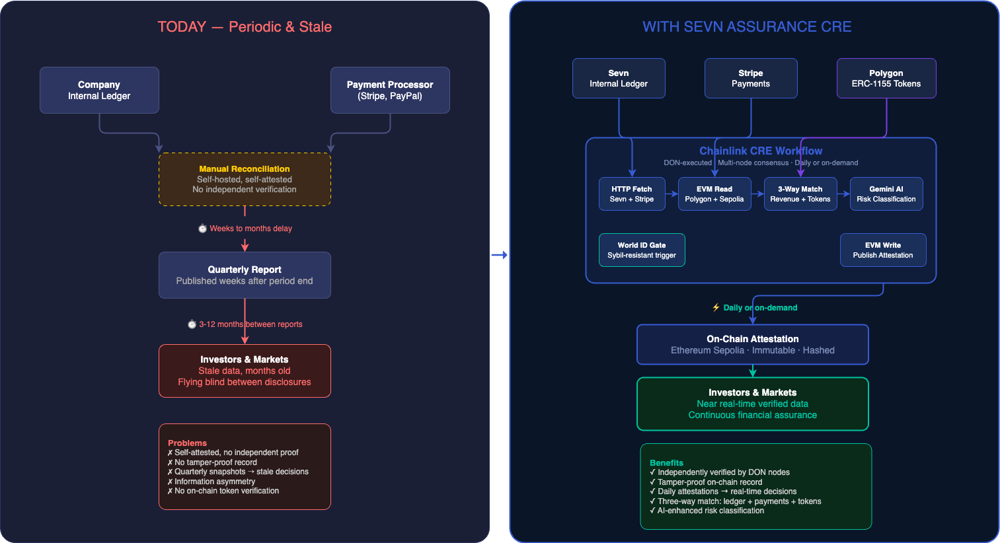
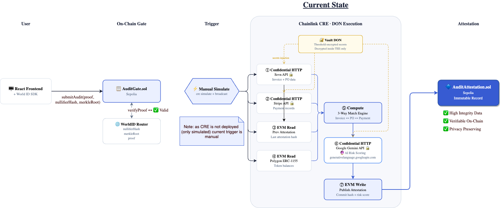
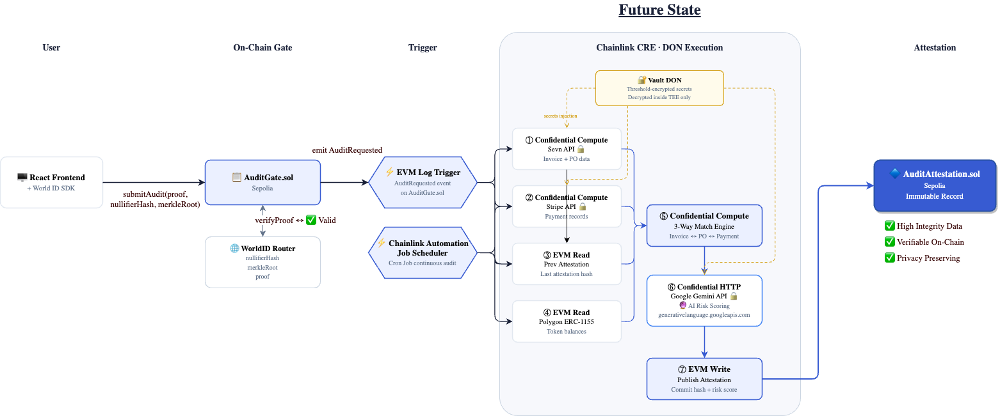

# Sevn Assurance CRE — Verifiable Financial Reconciliation

> **Chainlink Convergence Hackathon 2026**
> Tracks: Risk & Compliance | CRE & AI | World ID + CRE

<p align="center">
  
</p>

A Chainlink CRE workflow that performs **three-way reconciliation** across Sevn (internal ledger), Stripe (payment processor), and Polygon (ERC-1155 on-chain token supply), uses Google Gemini AI to classify risk, and publishes tamper-proof attestations on Ethereum — gated by World ID so only verified humans can trigger audits.

## Problem

Financial reporting today is **periodic and stale**. Public companies report quarterly, and those results are often published weeks after the period ends. Investors, lenders, and analysts make capital allocation decisions — worth billions — based on backward-looking snapshots that can be months old. Even quarterly reporting doesn't give capital markets an accurate pulse of how well a company is performing right now.

At the operational level, every business that accepts payments through a third-party processor (Stripe, PayPal, etc.) must reconcile two independent ledgers: their internal records vs. what the processor actually collected. Today this is done manually or via self-hosted automation — but the results are **self-attested**. There's no independent verification, no tamper-proof record, and no way for external parties to trust the numbers between reporting cycles.

The result: **information asymmetry**. Insiders have real-time data; external stakeholders — investors, regulators, creditors — are flying blind between periodic disclosures.

## Solution

We move the reconciliation engine onto Chainlink's decentralized oracle network. The CRE workflow:

1. **Is triggered** by a World ID–verified request (or a scheduled Cron run)
2. **Independently fetches** from both data sources (Sevn API + Stripe data)
3. **Reads previous attestations** from Sepolia for trend analysis
4. **Reads ERC-1155 token data** from Polygon (totalSupply, balanceOf) for on-chain verification
5. **Computes three-way match rates** — Sevn↔Stripe revenue + Sevn↔Polygon token supply
6. **Classifies risk** using Google Gemini AI
7. **Publishes an immutable attestation** on Ethereum with cryptographic hashes
8. **Restricts access** via World ID — only verified humans can request audits

## Architecture

### Current State — Hackathon Build

The workflow is fully functional via CRE simulation with on-chain broadcast. The React frontend connects to AuditGate.sol (World ID verification), and the CRE workflow is triggered manually via `cre simulate --broadcast`. All 7 steps execute end-to-end: confidential HTTP fetches, multi-chain EVM reads, three-way reconciliation, Gemini AI risk scoring, and attestation publishing to Sepolia.

<p align="center">
  
</p>

### Future State — Production Deployment

In production, manual simulation is replaced by native CRE triggers. An **EVM Log Trigger** watches for `AuditRequested` events from AuditGate.sol and auto-executes the workflow. A **Chainlink Automation Job Scheduler** runs the cron-based daily audit. HTTP steps upgrade to **Confidential Compute** for full TEE isolation. The workflow becomes fully autonomous — no human in the loop after the initial World ID–verified request.

<p align="center">
  
</p>

## Chainlink CRE Usage

### CRE Capabilities Used

| Capability | How It's Used |
|---|---|
| **HTTP Client** | Fetches Sevn and Stripe data from independent API endpoints |
| **Confidential HTTP** | Protects API credentials during data fetching |
| **EVM Read (Sepolia)** | Reads previous attestation for delta/trend analysis |
| **EVM Read (Polygon)** | Reads ERC-1155 totalSupply and balanceOf for token verification |
| **EVM Write** | Publishes attestation struct to AuditAttestation contract |
| **Log Trigger** | Event-driven execution when `AuditRequested` is emitted |
| **Cron Trigger** | Automated daily execution at 2:00 AM AEST |
| **DON Consensus** | Multiple nodes independently verify data and agree on result |

### Files Using Chainlink

| File | Role |
|---|---|
| [`my-workflow/src/main.ts`](my-workflow/src/main.ts) | CRE workflow — 7-step orchestration using `@chainlink/cre-sdk` (HTTP, EVM Read, EVM Write, Cron/Log Trigger, DON Consensus) |
| [`contracts/src/AuditAttestation.sol`](contracts/src/AuditAttestation.sol) | CRE consumer contract — implements `IReceiver` for KeystoneForwarder delivery |
| [`contracts/src/AuditGate.sol`](contracts/src/AuditGate.sol) | LogTrigger event source — emits `AuditRequested` for CRE event-driven execution |
| [`my-workflow/config.json`](my-workflow/config.json) | Workflow config — chain selectors, contract addresses, cron schedule |
| [`my-workflow/workflow.yaml`](my-workflow/workflow.yaml) | CRE workflow settings — artifact paths, workflow name |
| [`project.yaml`](project.yaml) | CRE project config — RPC endpoints for Sepolia and Polygon |
| [`trigger-simulator.ts`](trigger-simulator.ts) | Local LogTrigger simulator — listens for `AuditRequested` events and executes `cre workflow simulate` |

### Why CRE (not Functions)?

- **Multi-step orchestration**: 7 sequential steps with data dependencies
- **Multi-chain interaction**: reads from Polygon (token data) + Sepolia (attestations), writes to Sepolia
- **Three independent data sources**: Sevn API + Stripe data + Polygon on-chain state
- **AI integration**: Gemini API call for risk classification within the workflow
- **Institutional-grade**: Built on the same infrastructure used by Swift, UBS, J.P. Morgan

## Smart Contracts

### AuditAttestation.sol
Consumer contract that stores three-way reconciliation attestations. Each attestation is keyed by period date (YYYYMMDD) and includes revenue figures, revenue match rate, on-chain token supply/transfers, token match rate, AI risk classification, and cryptographic hashes.

### AuditGate.sol
World ID–gated trigger contract. Uses the World ID Router to verify ZK proofs from the IDKit widget. Nullifier tracking prevents Sybil attacks — each human can only request one audit per action.

**Attestation Chain**: Ethereum Sepolia
**Token Chain**: Polygon Mainnet (ERC-1155)
**World ID Router**: `0x469449f251692E0779667583026b5A1E99512157`

## Project Structure

```
sevn-audit-cre/
├── contracts/
│   └── src/
│       ├── AuditAttestation.sol    # CRE consumer — stores attestations
│       └── AuditGate.sol           # World ID gated trigger
├── my-workflow/
│   └── src/
│       └── main.ts                 # CRE workflow (7 steps, multi-chain)
├── frontend/
│   └── src/
│       └── App.tsx                 # React + World ID + ethers.js
├── project.yaml                    # CRE project configuration
└── README.md
```

## Data Sources

### Sevn Internal Truth (`/api/cre/sevn-truth`)
Revenue breakdown by payment method (CC, gift cards, payouts, promo, giveaway), total tokens sold, transaction count, and wallet liability — sourced from Sevn's internal transaction ledger and reconciliation engine.

### Stripe Truth (`/api/cre/stripe-truth`)
Gross collections, refunds, processing fees, net after fees, chargeback totals — sourced independently from Stripe's charge records.

### Polygon On-Chain Tokens (ERC-1155)
Sevn pre-mints all racehorse tokens into a company wallet, then transfers to customers on purchase. The CRE workflow reads `totalSupply(id)` and `balanceOf(sevnWallet, id)` directly from Polygon to compute tokens transferred (`totalSupply - sevnBalance`) and compares against Sevn's claimed `tokensSold`.

The CRE workflow fetches all three sources independently and cross-references them.

## Setup

### Prerequisites
- Bun v1.3+
- Node.js v20+
- Foundry (for contract deployment)
- CRE CLI
- MetaMask (for frontend)

### Install

```bash
# Workflow dependencies
cd my-workflow && bun install && cd ..

# Frontend dependencies
cd frontend && bun install && cd ..
```

### Configure

```bash
cp .env.example .env
# Fill in: private key, RPC URL, Gemini API key, contract addresses
```

### Deploy Contracts

```bash
forge create contracts/src/AuditAttestation.sol:AuditAttestation \
  --rpc-url $CRE_RPC_URL_SEPOLIA \
  --private-key $CRE_ETH_PRIVATE_KEY

forge create contracts/src/AuditGate.sol:AuditGate \
  --rpc-url $CRE_RPC_URL_SEPOLIA \
  --private-key $CRE_ETH_PRIVATE_KEY \
  --constructor-args 0x469449f251692E0779667583026b5A1E99512157 <APP_ID_HASH> <ACTION_ID_HASH>
```

### Submit Attestation (One-Off, Direct)

If you ran `cre workflow simulate` and want to prove the exact same payload can be written on-chain, copy the `Calldata (hex)` from the Step 6 logs and send it directly with the helper script:

```bash
export SEND_TO=0xCbE7BFBa7B3E4B0d1494E684B532c68d72e25895
export SEND_DATA=0x826ac4d7000000000000000000000000000000000000000000000000000000000135257e0000000000000000000000000000000000000000000000000000000000bebc2000000000000000000000000000000000000000000000000000000000009f127100000000000000000000000000000000000000000000000000000000000003e800000000000000000000000000000000000000000000000000000000000026e1000000000000000000000000000000000000000000000000000000000000000000000000000000000000000000000000000000000000000000000000004910d2329468b694d78df6b2584754c1145a36eaae72ce4cc1c4522c0d9036fe20a6e09f1b971ba5cd684c0e2e4e3ee6199dacc6da64d14cde2db5ea455b994c25051a000000000000000000000000000000000000000000000000000000001c3e53a400000000000000000000000000000000000000000000000000000000000003e800000000000000000000000000000000000000000000000000000000000003e8000000000000000000000000000000000000000000000000000000000000271000000000000000000000000000000000000000000000000000000000000001e000000000000000000000000000000000000000000000000000000000000002200000000000000000000000000000000000000000000000000000000000000034c4f57000000000000000000000000000000000000000000000000000000000000000000000000000000000000000000000000000000000000000000000000008a546865207269736b206973206c6f7720626563617573652074686520726576656e756520666967757265732061726520636c6f73656c79206d6174636865642c20616c6c20746f6b656e7320736f6c6420617265206163636f756e74656420666f72206f6e2d636861696e2c20616e6420746865726520617265206e6f206368617267656261636b732e00000000000000000000000000000000000000000000
cd contracts
forge script script/SendRaw.s.sol:SendRawScript \
  --rpc-url $CRE_RPC_URL_SEPOLIA \
  --private-key $CRE_ETH_PRIVATE_KEY \
  --broadcast
```

### Simulate Workflow

```bash
# Dry run (no on-chain write)
cre workflow simulate ./my-workflow -T staging-settings -R .

# Write attestation to Sepolia
cre workflow simulate ./my-workflow -T staging-settings -R . --broadcast
```

### Run Log-Trigger Simulator (Event-Driven)

In production, a CRE LogTrigger watches `AuditRequested` and auto-executes the workflow. Locally, use the simulator:

```bash
# Terminal 1: Start the event listener
bun run trigger

# Terminal 2: Start the frontend
cd frontend && bun run dev
```

### Run Frontend

```bash
cd frontend && bun run dev
```

## Demo

The video demonstrates:
1. World ID verification in the browser
2. AuditGate contract receiving the proof on Sepolia
3. CRE workflow executing — fetching Sevn + Stripe data, reading Polygon ERC-1155 tokens, AI classification
4. Three-way attestation published on-chain with revenue match + token match rates
5. Frontend displaying the verified attestation with all metrics

## Real-World Impact

This replaces trust-based, point-in-time financial auditing with **continuous, independently-verified assurance** — giving capital markets access to up-to-the-minute financial data instead of stale quarterly snapshots:

- **For investors & capital markets**: Near real-time verified financial data for more accurate valuation, better price discovery, and more informed capital allocation decisions — instead of waiting months for outdated quarterly reports
- **For regulators**: Daily tamper-proof attestations instead of annual audits, enabling earlier detection of discrepancies
- **For auditors**: Cryptographic proof reduces re-performance work; continuous data trail replaces point-in-time sampling
- **For businesses**: Automated compliance that runs while you sleep, and the ability to signal financial health to markets continuously
- **For users**: Transparent proof that their payments match the platform's records

## License

MIT
